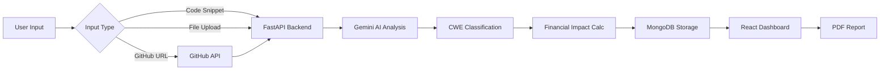

<div align="center">

# 🛡️ VulnExplain

### AI-Powered Security Audit SaaS Platform

*Comprehensive vulnerability analysis for modern applications*

[](https://www.python.org/)
[](https://fastapi.tiangolo.com/)
[](https://reactjs.org/)
[](https://www.mongodb.com/)
[](https://tailwindcss.com/)

[Features](#-features) • [Installation](#-installation--setup) • [API Docs](#-api-endpoints) • [Tech Stack](#-tech-stack)

</div>

---

## 🚀 Features

<table>
<tr>
<td width="50%">

### 🤖 AI-Powered Analysis
- **Gemini AI Integration** for intelligent vulnerability detection
- **CWE-Based Classification** with industry standards
- **SOC 2 Compliance Mapping** for enterprise security
- **Deduplication Engine** to eliminate false positives

</td>
<td width="50%">

### 💰 Financial Impact Assessment
- **Developer Remediation Costs** (₹2,500/hr avg)
- **Downtime Loss Calculation** (₹50,000/hr avg)
- **DPDP Act 2023 Compliance Fines**
- **Reputation & Churn Analysis**

</td>
</tr>
<tr>
<td width="50%">

### 📊 Advanced Analytics
- **Security Score** (0-100 gauge)
- **Severity Distribution** charts
- **Financial Risk Breakdown** visualization
- **Real-time Vulnerability Categorization**

</td>
<td width="50%">

### 🔧 Multi-Input Support
- **Code Snippet Analysis**
- **File Upload** (up to 20 files)
- **GitHub Repository Scanning**
- **PDF Report Generation**

</td>
</tr>
</table>

---

## 📋 Tech Stack

### Backend
```
FastAPI (Python)     → High-performance async API
MongoDB + Motor      → Async database with scalability
Google Gemini AI     → Advanced vulnerability detection
ReportLab            → Professional PDF reports
JWT Authentication   → Secure API access
```

### Frontend
```
React 19             → Modern, fast UI framework
Radix UI + shadcn/ui → Accessible component library
Tailwind CSS         → Utility-first styling
React Router         → Client-side routing
Axios                → Promise-based HTTP client
CRACO                → Custom CRA configuration
```

---

## 🛠️ Installation & Setup

### Prerequisites

```bash
✓ Python 3.8+
✓ Node.js 16+
✓ MongoDB (local or cloud)
✓ Gemini API Key
```

### Backend Setup

```bash
# 1. Navigate to backend directory
cd backend

# 2. Install dependencies
pip install -r requirements.txt

# 3. Configure environment variables
cp .env.example .env
# Edit .env and add your Gemini API key

# 4. Start the server
python -m uvicorn server:app --reload --port 8000
```

### Frontend Setup

```bash
# 1. Navigate to frontend directory
cd frontend

# 2. Install dependencies
npm install

# 3. Configure environment variables
cp .env.example .env
# Edit .env if needed (default: http://localhost:8000)

# 4. Start the development server
npm start
```

**Application URLs:**
- Frontend: `http://localhost:3000`
- Backend API: `http://localhost:8000`
- API Docs: `http://localhost:8000/docs`

---

## 🔑 Environment Variables

### Backend (`backend/.env`)

```bash
MONGO_URL="mongodb://localhost:27017"
DB_NAME="vuln_database"
CORS_ORIGINS="*"
EMERGENT_LLM_KEY=your_gemini_api_key_here  # Get from https://aistudio.google.com/app/apikey
```

### Frontend (`frontend/.env`)

```bash
REACT_APP_BACKEND_URL=http://localhost:8000
WDS_SOCKET_PORT=443
ENABLE_HEALTH_CHECK=false
```

---

## 📖 API Endpoints

| Method | Endpoint | Description |
|--------|----------|-------------|
| `GET` | `/api/` | Health check |
| `POST` | `/api/audit` | Audit a code snippet |
| `POST` | `/api/audit-repo` | Audit a GitHub repository or uploaded file |
| `POST` | `/api/generate-report` | Generate PDF security report |

### Example Request

```bash
curl -X POST "http://localhost:8000/api/audit" \
  -H "Content-Type: application/json" \
  -d '{
    "code_snippet": "import os; password = \"hardcoded123\"",
    "language": "python"
  }'
```

---

## 💡 How It Works



---

## 🎨 Features Highlights

### Security Analysis
✓ Deterministic severity scoring based on CWE mapping  
✓ Evidence-based vulnerability detection  
✓ No speculative or hypothetical issues  
✓ Automatic deduplication of findings  

### Financial Impact (Indian Enterprise Data)
✓ **Fix Costs:** Developer hours × ₹2,500/hr  
✓ **Downtime:** Revenue loss @ ₹50,000/hr  
✓ **Legal Fines:** DPDP Act 2023 penalties  
✓ **Reputation:** Customer churn impact  

### User Experience
✓ Clean, modern UI with dark mode support  
✓ Real-time vulnerability categorization  
✓ Interactive charts and analytics  
✓ Responsive design for all devices  

---

## 🚀 Production Deployment

### Backend

```bash
cd backend
pip install -r requirements.txt
python -m uvicorn server:app --host 0.0.0.0 --port 8000
```

### Frontend

```bash
cd frontend
npm run build
# Serve the build directory with nginx, apache, or any web server
```

---

## 🧪 Development

The project includes:
- ✅ Custom emergentintegrations wrapper for AI integration
- ✅ Hot-reload for both frontend and backend
- ✅ Comprehensive error handling
- ✅ Async/await patterns throughout
- ✅ Type hints and validation with Pydantic

---

## 📊 Severity Mapping

| CWE | Severity | Fix Time | Examples |
|-----|----------|----------|----------|
| CWE-89, CWE-79, CWE-78 | **Critical** | 24h | SQL Injection, XSS, Command Injection |
| CWE-601, CWE-352, CWE-918 | **High** | 8h | Open Redirect, CSRF, SSRF |
| CWE-532, CWE-200, CWE-327 | **Medium** | 4h | Log Exposure, Info Leak, Weak Crypto |
| CWE-676, CWE-732 | **Low** | 1h | Dangerous Functions, Permissions |

---

## 📝 License

This project is proprietary software.

---

## 🤝 Contributing

This is a private project. For questions or issues, please contact the development team.

---

## 🙏 Acknowledgments

- **IBM Cost of Data Breach Report 2024** - Financial impact data
- **DPDP Act 2023** - Compliance fine estimates
- **Google Gemini AI** - Vulnerability detection engine
- **shadcn/ui** - Beautiful UI components

---

<div align="center">

**Built with ❤️ using FastAPI, React, and Gemini AI**

[⬆ Back to Top](#-vulnexplain)

</div>
